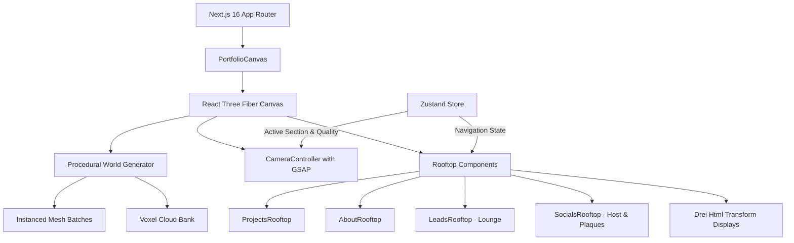

<div align="center">

# 🌆 Manuel's Roofies
### Procedural Voxel 3D Rooftop Portfolio & District

[](https://nextjs.org/)
[](https://react.dev/)
[](https://threejs.org/)
[](https://docs.pmnd.rs/react-three-fiber)
[](https://www.typescriptlang.org/)
[](https://zustand-demo.pmnd.rs/)
[](https://openai.com)
[](https://deepmind.google)
[](LICENSE)

An immersive, fully procedural 3D voxel portfolio showcasing the work, skills, and creative universe of **John Manuel Cuerdo** (`@manwel.ac`). Built entirely in code with zero external 3D model dependencies or heavy asset downloads.

> 💡 **Origins & Collaboration:**  
> The core 3D procedural world and rooftop architecture were originally designed by **GPT-6 Astra**, then evolved, refined, and polished through advanced pair-programming with **Antigravity** (Google DeepMind).

[Live Demo](http://localhost:3000) · [Explore Districts](#-rooftop-districts) · [Tech Architecture](#-tech-architecture) · [Getting Started](#-getting-started)

---

</div>

## ✨ Highlights

- 🏙️ **Procedural Voxel World**: Instant loading with zero 3D model files (`.gltf`/`.glb`). Every building, bridge, skylight, and voxel is computed programmatically and batched into shared instanced meshes for lightning-fast 60 FPS performance.
- 🎮 **Living Rooftop Characters**:
  - **Lounge**: Cozy social hub with two animated voxel characters having coffee banter under pergola festoon lights.
  - **Socials**: Interactive voxel host standing on the left side, gesturing towards social tiles with dynamic pixel speech bubbles.
- 🎯 **Interactive 3D Display Screens**: High-fidelity DOM interfaces transformed seamlessly into 3D world planes using `@react-three/drei`'s `Html transform` with linear filtering and native interaction.
- 🎥 **Cinematic GSAP Camera Travel**: Smooth transitions between cinematic overview and close-up reading angles with smart desktop/mobile boundary constraints.
- 📱 **Mobile & Performance Responsive**: Automatically adapts DPR, geometry detail, and camera field-of-view; respects `prefers-reduced-motion` accessibility preferences.

---

## 🗺️ Rooftop Districts

```
                  ┌──────────────────────┐
                  │   MANUEL'S ROOFIES   │
                  │   Overview District  │
                  └──────────┬───────────┘
                             │
       ┌─────────────────────┼─────────────────────┐
       ▼                     ▼                     ▼
┌──────────────┐      ┌──────────────┐      ┌──────────────┐
│ 🚀 PROJECTS  │      │  ☕ LOUNGE   │      │ 🌐 SOCIALS   │
│ 3D Carousel  │◄────►│ Ambient Hub  │◄────►│  Voxel Host  │
│  & Showcases │      │ & Characters │      │   & Links    │
└──────┬───────┘      └──────────────┘      └──────────────┘
       │
       ▼
┌──────────────┐
│  👤 ABOUT    │
│ Interactive  │
│ Multi-Archive│
└──────────────┘
```

| Rooftop | Theme & Experience | Key Interactions |
| :--- | :--- | :--- |
| **🚀 Projects** | Interactive physical carousel & detail cabinet | Browse project cards, filter by category, view tech stacks, live links, and full-resolution screenshot galleries. |
| **👤 About** | Retro-futuristic archive station | Switch between **Profile**, **Tech Stack**, **Education**, and **My Journey** tabs. Accessible CV download trigger. |
| **☕ Lounge** | Ambient rooftop chillout space | Conversing animated voxel characters (Manuel & Guest), sectional sofa, warm festoon lighting, pergola, and coffee table. |
| **🌐 Socials** | Interactive social hub & voxel guide | Animated host character on the left side with auto-cycling speech bubbles introducing Instagram, TikTok, and LinkedIn. |

---

## 🛠️ Tech Architecture



### Core Technologies

| Layer | Library | Purpose |
| :--- | :--- | :--- |
| **Framework** | [Next.js 16 (App Router)](https://nextjs.org/) | Server and client component architecture, modern bundling, Turbopack support. |
| **3D Engine** | [Three.js](https://threejs.org/) & [R3F 9](https://docs.pmnd.rs/react-three-fiber) | WebGL rendering, custom materials, instanced procedural geometry. |
| **3D Helpers** | [@react-three/drei](https://github.com/pmndrs/drei) | HTML transforms, performance monitors, canvas event handling. |
| **Animation** | [GSAP 3](https://greensock.com/gsap/) | Seamless easing and cinematic camera travel between coordinates. |
| **State Management** | [Zustand 5](https://github.com/pmndrs/zustand) | Global navigation, quality toggle, project modals, and transition states. |
| **Forms & Validation** | [React Hook Form](https://react-hook-form.com/) + [Zod](https://zod.dev/) | Client & server schema validation and accessible UI handling. |
| **Typography** | Google Fonts ([Silkscreen](https://fonts.google.com/specimen/Silkscreen), [Inter](https://fonts.google.com/specimen/Inter)) | Authentic pixel lettering paired with crisp, readable modern copy. |

---

## 📂 Project Structure

```text
├── app/
│   ├── api/contact/route.ts   # Contact API route
│   ├── globals.css            # Custom CSS variables, pixel font styles, speech bubbles
│   ├── layout.tsx             # Root layout with metadata and fonts
│   └── page.tsx               # Main entry rendering 3D Canvas and UI overlays
├── components/
│   ├── portfolio/             # UI layer, HUD navigation bar, and section modals
│   ├── sections/              # Standalone 2D HTML fallbacks and contact forms
│   └── world/                 # 3D R3F components
│       ├── CameraController.tsx    # GSAP camera tweens and orbit limits
│       ├── PortfolioCanvas.tsx     # Three.js canvas setup, lights, and roofs
│       ├── ProjectsRooftop.tsx     # Physical project carousel and screenshot wall
│       ├── AboutRooftop.tsx        # Multi-tab dossier boards and milestone cards
│       ├── LeadsRooftop.tsx        # 3D Lounge with sofa, coffee, and talking characters
│       ├── SocialsRooftop.tsx      # Social plaques & animated host character
│       └── WorldDisplay.tsx        # Physical bezel & Drei Html surface wrapper
├── data/
│   ├── contact.ts             # Contact details and email configurations
│   ├── profile.ts             # Biography, education history, tech stack, and timeline
│   ├── projects.ts            # Discovered portfolio projects and screenshot sets
│   └── socials.ts             # Social media handles (Instagram, TikTok, LinkedIn)
├── public/                    # Project screenshots and static public assets
├── three/
│   ├── cameraPositions.ts     # Rooftop coordinates, dimensions, and camera shots
│   ├── generateWorld.ts       # Algorithmic voxel generator (buildings, bridges, skyline)
│   └── pixelLettering.ts      # 5x7 procedural pixel font engine
└── scripts/
    └── verify-assets.mjs      # Asset and image path verification script
```

---

## 🚀 Getting Started

### Prerequisites

- **Node.js**: `v18.18+` or `v20+`
- **pnpm**: `v9+` or `v11+` (recommended)

### Installation

```bash
# 1. Clone the repository
git clone https://github.com/manwelAC/manuel3dcuerdo.git

# 2. Enter project folder
cd manolo3dportfolio

# 3. Install dependencies
pnpm install

# 4. Start local development server
pnpm dev
```

Open [http://localhost:3000](http://localhost:3000) in your browser.

### Production Build

```bash
# Run type checks
pnpm exec tsc --noEmit

# Lint codebase
pnpm lint

# Build production bundle
pnpm build

# Start production server
pnpm start
```

---

## 📝 Customizing Content

All text, projects, and personal information are decoupled into clean TypeScript data files in the `data/` directory:

- **Projects (`data/projects.ts`)**: Add or edit projects, descriptions, tags, live URLs, and screenshots. Set `featured: true` to place a project prominently.
- **Profile (`data/profile.ts`)**: Update biography, tech skills by category, academic background, and timeline milestones.
- **Socials (`data/socials.ts`)**: Configure your accounts for Instagram, TikTok, LinkedIn, or add custom platforms.
- **Contact (`data/contact.ts`)**: Edit default email, location, and messaging copy.

---

## 👥 Credits & Collaborators

- **John Manuel Cuerdo** ([@manwel.ac](https://www.instagram.com/manwel.ac) / `manwelAC`)  
  *Creator, Full-Stack Developer & Creative Vision*  
  - 📸 Instagram: [@manwel.ac](https://www.instagram.com/manwel.ac)  
  - 🎬 TikTok: [@manwel.ac](https://www.tiktok.com/@manwel.ac)  
  - 💼 LinkedIn: [John Manuel Cuerdo](https://www.linkedin.com/in/manwelac)  
  - 🐙 GitHub: [@manwelAC](https://github.com/manwelAC)

- **GPT-6 Astra**  
  *Main 3D World Architect, Procedural Voxel Engine & Core Rooftop Concept Design*

- **Antigravity** (Google DeepMind)  
  *AI Pair Programmer — Interactive Voxel Characters, Rooftop District Expansions, UX Refinement & Modern Polish*

---

## 📄 License

This project is licensed under the [MIT License](LICENSE).
Feel free to use it as inspiration for your own creative portfolios!
